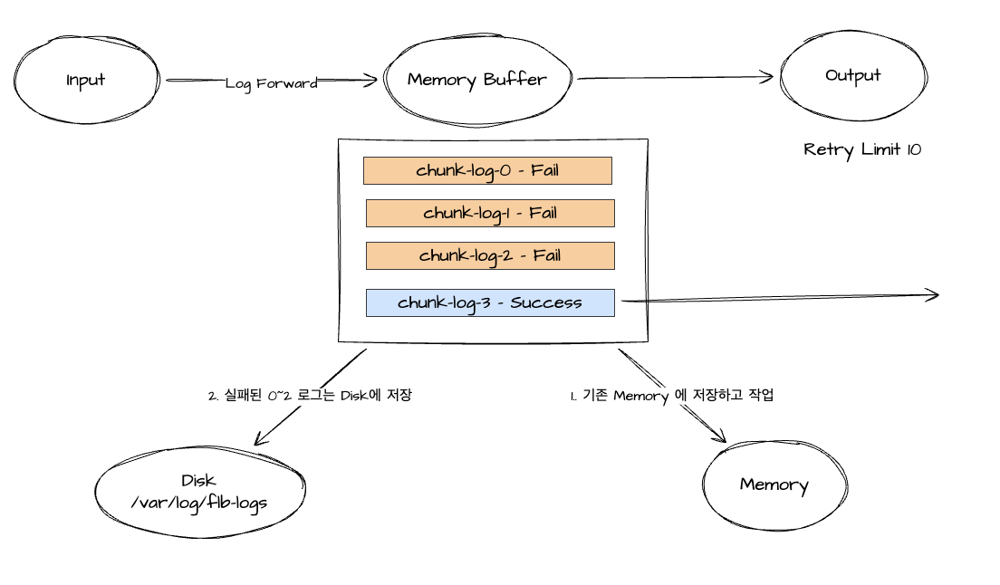
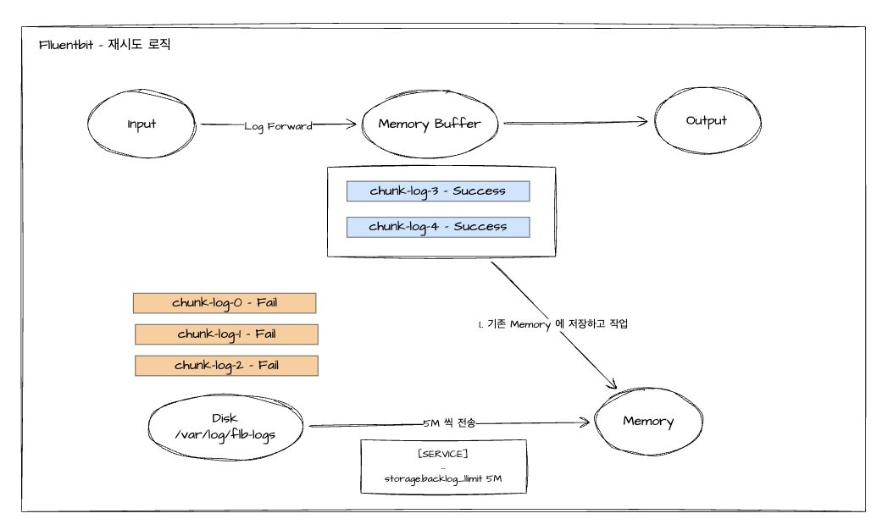

# Fluentbit

## FluentBit 에서의 로그 재시도 구성



- 로그 전송과정에서 OUTPUT Retry Limit에 의해 재시도
- 재시도 구성에서도 실패 시, 기존 작업하던 메모리가 아닌 Disk로 전송 (0 ~ 2)
- 이때 [SERVICE] 섹션에서 스토리지 구성 존재해야 함

```sh
[SERVICE]
    ...
    storage.path /var/log/flb-storage/
    storage.sync normal
    storage.checksum off
    storage.backlog.mem_limit 5M
    storage.metrics on
```



- output 부분 정상동작 시, 누락된 로그 (디스크에 저장)를 재전송
- 이때 mem_limit 구성된 양으로 Memory에 옮기면서 작업함

```sh
storage.backlog.mem_limit 5M
```

## Fluentbit Filter

- \*parser
- \*modify
- nest
- record_modifier
- \*grep
- throttle
- \*kubernetes
- aws
- lua
- multiline
- geoip
- rewrite_tag
- checklist
