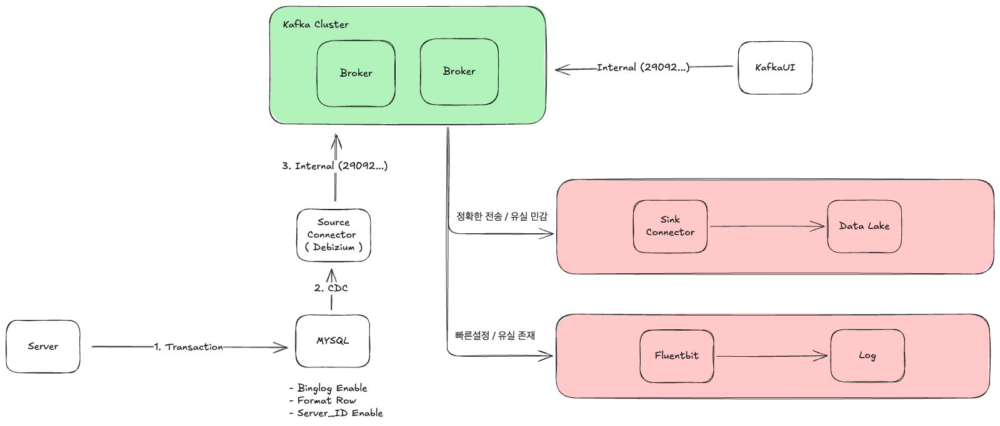
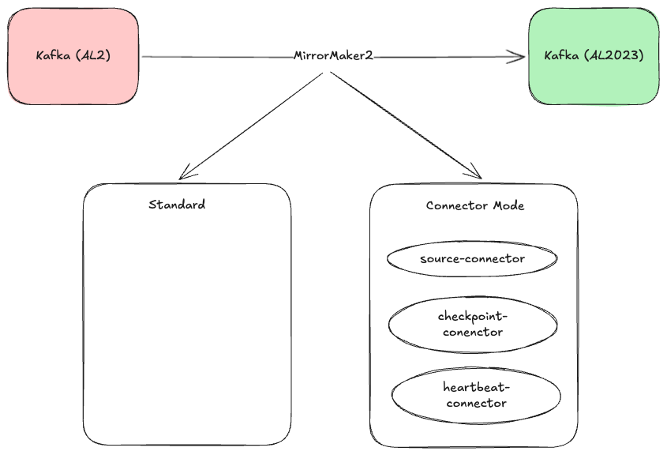

# Kafka




## Connectors

```sh
    curl -i localhost:8083
    curl -i localhost:8083/connectors
    curl -i localhost:8083/connectors/[connector-name]/status

    ## config 삭제 / 재등록
    curl -X DELETE http://localhost:8083/connectors/[connector-name]
    curl -X POST http://localhost:8083/connectors \
      -H "Content-Type: application/json" \
      -d @$(PWD)/configs//debizium/source.json
    
```

## Trouble Shooting

### Source Connector (Debizium) Authorization Error
```sh
2025-10-19 05:38:44,735 WARN   ||  WorkerSourceTask{id=mysql-source-connector-0} failed to poll records from SourceTask. Will retry operation.   [org.apache.kafka.connect.runtime.AbstractWorkerSourceTask]
org.apache.kafka.connect.errors.RetriableException: An exception occurred in the change event producer. This connector will be restarted.
        at io.debezium.pipeline.ErrorHandler.setProducerThrowable(ErrorHandler.java:63)
        at io.debezium.pipeline.ChangeEventSourceCoordinator.lambda$start$0(ChangeEventSourceCoordinator.java:144)
        at java.base/java.util.concurrent.Executors$RunnableAdapter.call(Executors.java:515)
        at java.base/java.util.concurrent.FutureTask.run(FutureTask.java:264)
        at java.base/java.util.concurrent.ThreadPoolExecutor.runWorker(ThreadPoolExecutor.java:1128)
        at java.base/java.util.concurrent.ThreadPoolExecutor$Worker.run(ThreadPoolExecutor.java:628)
        at java.base/java.lang.Thread.run(Thread.java:829)
Caused by: io.debezium.DebeziumException: java.sql.SQLSyntaxErrorException: Access denied; you need (at least one of) the RELOAD or FLUSH_TABLES privilege(s) for this operation
        at io.debezium.pipeline.source.AbstractSnapshotChangeEventSource.execute(AbstractSnapshotChangeEventSource.java:101)
        at io.debezium.pipeline.ChangeEventSourceCoordinator.doSnapshot(ChangeEventSourceCoordinator.java:250)
        at io.debezium.pipeline.ChangeEventSourceCoordinator.doSnapshot(ChangeEventSourceCoordinator.java:234)
        at io.debezium.pipeline.ChangeEventSourceCoordinator.executeChangeEventSources(ChangeEventSourceCoordinator.java:186)
        at io.debezium.pipeline.ChangeEventSourceCoordinator.lambda$start$0(ChangeEventSourceCoordinator.java:137)
        ... 5 more
Caused by: java.sql.SQLSyntaxErrorException: Access denied; you need (at least one of) the RELOAD or FLUSH_TABLES privilege(s) for this operation
        at com.mysql.cj.jdbc.exceptions.SQLError.createSQLException(SQLError.java:121)
        at com.mysql.cj.jdbc.exceptions.SQLExceptionsMapping.translateException(SQLExceptionsMapping.java:122)
        at com.mysql.cj.jdbc.StatementImpl.executeInternal(StatementImpl.java:763)
        at com.mysql.cj.jdbc.StatementImpl.execute(StatementImpl.java:648)
        at io.debezium.jdbc.JdbcConnection.executeWithoutCommitting(JdbcConnection.java:1451)
        at io.debezium.connector.mysql.MySqlSnapshotChangeEventSource.tableLock(MySqlSnapshotChangeEventSource.java:524)
        at io.debezium.connector.mysql.MySqlSnapshotChangeEventSource.readTableStructure(MySqlSnapshotChangeEventSource.java:313)
        at io.debezium.connector.mysql.MySqlSnapshotChangeEventSource.readTableStructure(MySqlSnapshotChangeEventSource.java:59)
        at io.debezium.relational.RelationalSnapshotChangeEventSource.doExecute(RelationalSnapshotChangeEventSource.java:149)
        at io.debezium.pipeline.source.AbstractSnapshotChangeEventSource.execute(AbstractSnapshotChangeEventSource.java:92)
        ... 9 more
2025-10-19 05:38:44,736 INFO   ||  Awaiting end of restart backoff period after a retriable error   [io.debezium.connector.common.BaseSourceTask]
```

- Debizium 시, 위와 같은 에러 발생
- 권한이 재대로 부여되지 않거나, 데이터베이스 설정이 재대로 되지 않은 경우 발생

```sh
CREATE USER 'debezium'@'%' IDENTIFIED BY 'debezium1234';

# Debezium에 필요한 모든 권한 부여
GRANT SELECT ON test_db.* TO 'debezium'@'%';
GRANT RELOAD ON *.* TO 'debezium'@'%';
GRANT REPLICATION SLAVE ON *.* TO 'debezium'@'%';
GRANT REPLICATION CLIENT ON *.* TO 'debezium'@'%';
GRANT LOCK TABLES ON test_db.* TO 'debezium'@'%';
FLUSH PRIVILEGES;

# 권한 확인
SHOW GRANTS FOR 'debezium'@'%';
```

### MirrorMaker2 Log4j Error

```sh
 idong-gyu@idong-gyuui-Macmini  ~/dev/golang-pjt/fpg   master ±  docker logs mm2
Starting MirrorMaker 2...
log4j:ERROR Could not read configuration file from URL [file:/usr/bin/../config/connect-log4j.properties].
java.io.FileNotFoundException: /usr/bin/../config/connect-log4j.properties (No such file or directory)
        at java.base/java.io.FileInputStream.open0(Native Method)
        at java.base/java.io.FileInputStream.open(FileInputStream.java:219)
        at java.base/java.io.FileInputStream.<init>(FileInputStream.java:157)
        at java.base/java.io.FileInputStream.<init>(FileInputStream.java:112)
        at java.base/sun.net.www.protocol.file.FileURLConnection.connect(FileURLConnection.java:86)
        at java.base/sun.net.www.protocol.file.FileURLConnection.getInputStream(FileURLConnection.java:184)
        at org.apache.log4j.PropertyConfigurator.doConfigure(PropertyConfigurator.java:532)
        at org.apache.log4j.helpers.OptionConverter.selectAndConfigure(OptionConverter.java:485)
        at org.apache.log4j.LogManager.<clinit>(LogManager.java:115)
        at org.slf4j.impl.Reload4jLoggerFactory.<init>(Reload4jLoggerFactory.java:67)
        at org.slf4j.impl.StaticLoggerBinder.<init>(StaticLoggerBinder.java:72)
        at org.slf4j.impl.StaticLoggerBinder.<clinit>(StaticLoggerBinder.java:45)
        at org.slf4j.LoggerFactory.bind(LoggerFactory.java:150)
        at org.slf4j.LoggerFactory.performInitialization(LoggerFactory.java:124)
        at org.slf4j.LoggerFactory.getILoggerFactory(LoggerFactory.java:417)
        at org.slf4j.LoggerFactory.getLogger(LoggerFactory.java:362)
        at org.slf4j.LoggerFactory.getLogger(LoggerFactory.java:388)
        at org.apache.kafka.connect.mirror.MirrorMaker.<clinit>(MirrorMaker.java:101)
log4j:ERROR Ignoring configuration file [file:/usr/bin/../config/connect-log4j.properties].
log4j:WARN No appenders could be found for logger (org.apache.kafka.connect.mirror.MirrorMaker).
log4j:WARN Please initialize the log4j system properly.
log4j:WARN See http://logging.apache.org/log4j/1.2/faq.html#noconfig for more info.
```

- /usr/bin/../config/connect-log4j.properties 파일이 없다고 나옴
- confluent cp 7.5.3 이미지에서 잘못설정한 것 같음

```sh
    docker exec -it mm2 /bin/bash
    cd /etc/kafka
    
    cp connect-log4g.properties

    저걸 위 path에 volume 해주면 에러안남
```

## Kafka 성능 테스트

```sh
    ## /bin...

    ## producer test
    ./kafka-producer-perf-test  --topic test --num-records 10000 --throughput -1 --producer-props \
    bootstrap.servers="172.31.0.4:29092,172.31.0.5:29092" batch.size=10 acks=all linger.ms=100 buffer.memory=4294967296 request.timeout.ms=300000 --record-size 100
    
    ## --num-records : 테스트 진행할 레코드 개수
    ## --throughput : 초당 전송 레코드 수
    ## batch.size 묶어서 보낼 처리량단위, 메시지 크기보다 커야하며, 메시지크기가 평균 1K 라면 10 설정 시, 10개씩 묶어 보내는것임
    ## linger.ms batch로 묶는 것을 기다리는 시간 (batch.size 를 크게줘도, linger.ms 에 도달하면 다 채우기전에 전송)
    ## acks (0 , 1 , -1)
    ## --record-size : 메시지 크기
```

```sh
# 결과화면

sh-4.4$ ./kafka-producer-perf-test  --topic test --num-records 10000 --throughput -1 --producer-props \
>     bootstrap.servers="172.31.0.4:29092,172.31.0.5:29092" batch.size=10 acks=all linger.ms=100 buffer.memory=4294967296 request.timeout.ms=300000 --record-size 100
[2025-10-19 07:44:27,654] WARN [Producer clientId=perf-producer-client] delivery.timeout.ms should be equal to or larger than linger.ms + request.timeout.ms. Setting it to 300100. (org.apache.kafka.clients.producer.KafkaProducer)
[2025-10-19 07:44:28,374] WARN [Producer clientId=perf-producer-client] Error while fetching metadata with correlation id 2 : {test=UNKNOWN_TOPIC_OR_PARTITION} (org.apache.kafka.clients.NetworkClient)
[2025-10-19 07:44:28,556] WARN [Producer clientId=perf-producer-client] Error while fetching metadata with correlation id 5 : {test=UNKNOWN_TOPIC_OR_PARTITION} (org.apache.kafka.clients.NetworkClient)
5162 records sent, 1032.4 records/sec (0.10 MB/sec), 2324.0 ms avg latency, 3205.0 ms max latency.
10000 records sent, 1424.907381 records/sec (0.14 MB/sec), 3199.36 ms avg latency, 4907.00 ms max latency, 3080 ms 50th, 4813 ms 95th, 4895 ms 99th, 4906 ms 99.9th.
```
 

## Ref

- <a href="https://www.confluent.io/hub/"> Confluent Hub </a>
- <a href="https://debezium.io/documentation/"> Debizium Document </a>